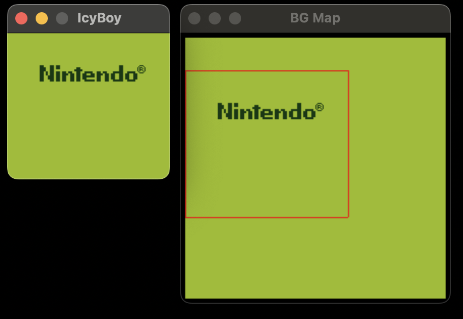
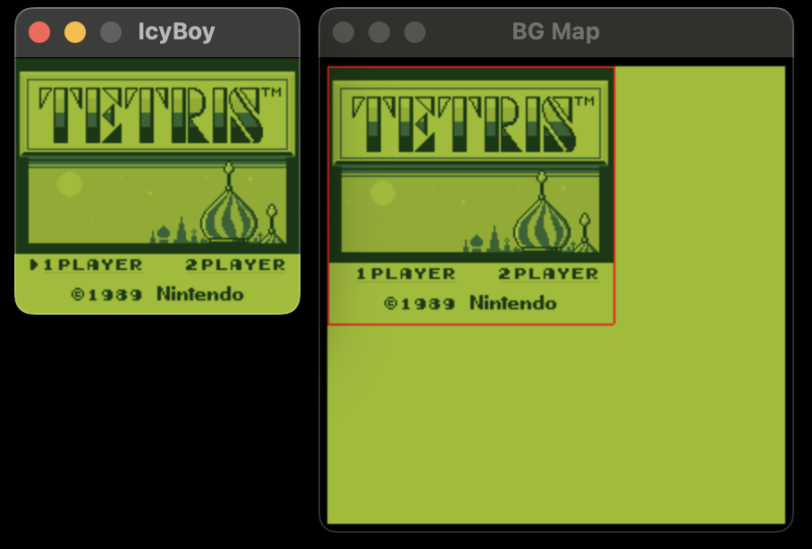

# icyboy
A GameBoy emulator for macOS and Nintendo Switch (WIP), written in C.

Complete with a BG Map viewer with scrolling viewport.

Currently requires a GameBoy bootrom image. Tetris is the only game that boots without severe graphical errors.

## Screenshots




## Building and running

For macOS, [SDL2](https://www.libsdl.org/) is required. Then build with cmake from the platforms/macos folder.

For Switch, [devkitpro](https://devkitpro.org/) is required. Build with make from the platforms/switch folder.

To run:
```
icyboy <path_to_bootrom.bin> <path_to_rom.gb> [options]
```

Where `[options]` can be `-v` to log every cpu instruction, and/or `-b` to pause execution after the bootrom.
